# 「NginX를 살려라」 — 광명융합기술교육원 5조


> Attack/Defense CTF 가용성 방어 · 방어 전용 · 우리 팀 채점 다운 **0회**

> ⚠️ **핵심 제약 조건:** 규칙상 공격자(교수)를 **차단·권한제한·명령제한할 수 없습니다.** (포트폴리오의 방어 전략이 '격리'와 '우회'에 집중된 이유입니다.)

<details>
<summary><b>원본 미션 공지 스크린샷 보기 (클릭)</b></summary>
<br>

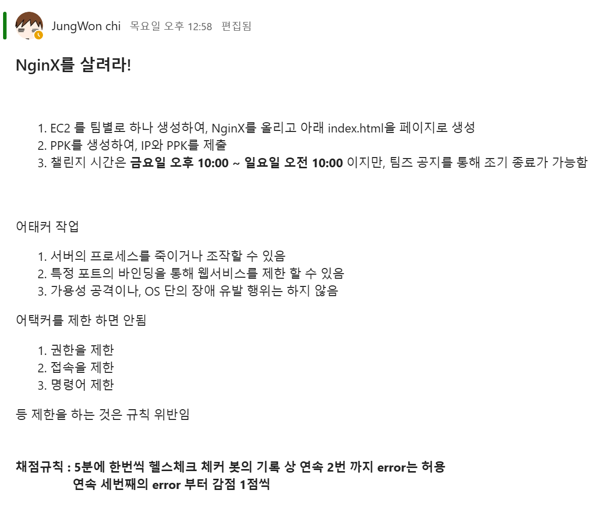

</details>

> **이 프로젝트의 정의** — 본 프로젝트는 root 권한 공격자를 완전히 차단하는 프로젝트가 아니라, 제한된 CTF 환경에서 nginx 서비스의 **복구 시간 단축**과 **장애 격리**를 높이기 위한 가용성 실험이다. 핵심은 '무적 서버'가 아니라 **장애 감지 → 복구 시도 → 실패 시 트래픽 격리 → 정상 노드로 우회**하는 흐름이다.

> **범위·윤리 고지** — 권한이 부여된 교육용 CTF 경기 박스 안에서 우리 팀 nginx 가용성을 방어한 기록입니다. 모든 자동복구·모니터링 기법은 자기 서비스 가용성 유지가 목적이며, 공개 저장소이므로 공인 IP·webhook URL·팀 외 개인정보는 마스킹(`X.X.X.X`, `<REDACTED_WEBHOOK_URL>`)했습니다.

<details open>
<summary><b>📑 목차 (클릭하여 접기/펴기)</b></summary>

<br>

**📋 소개 및 배경**
* [1. 프로젝트 개요](#1--프로젝트-개요)
* [2. 팀 — 5조](#2--팀--5조)
* [3. CTF 규칙 · 위협 모델](#3--ctf-규칙--위협-모델)
* [4. 핵심 목표](#4--핵심-목표)

**🛡️ 설계 및 방어 전략**
* [5. 전체 아키텍처](#5--전체-아키텍처)
* [6. 방어 계층](#6--방어-계층)

**📊 성과 및 회고**
* [7. 실제 효과](#7--실제-효과)
* [8. 실전 관제 · 공격 · 협업 증거](#8--실전-관제--공격--협업-증거)
* [9. 한계와 개선점](#9--한계와-개선점)
* [10. 실무 확장 방안](#10--실무-확장-방안)

**📂 실행 및 부록**
* [11. 디렉터리 구조](#11--디렉터리-구조)
* [12. 실행 방법](#12--실행-방법)

</details>

---

## 1. 📋 프로젝트 개요

교수(어태커)가 `#1` 서버에 SSH root로 들어와 nginx를 죽이고 80 포트를 하이재킹하고 부팅 경로를 차단하는 Attack/Defense CTF에서, **공격자를 차단하지 않고** 자동복구 + 변조 감지 + 자가격리 + 트래픽 우회로 nginx 가용성을 유지했다. 경기 내내 우리 팀 백엔드는 채점 기준 **다운 0회**를 기록했다.

root 공격자는 마음만 먹으면 로컬 방어(`chattr`·systemd·cron·watchdog)를 우회할 수 있다. 그래서 목표를 "완전 차단"이 아니라 **복구를 자동화하고, 끝내 오염되면 그 노드를 채점망에서 빼 정상 노드로 우회**하는 데 뒀다.

**기술 스택** — nginx · systemd · cron · auditd · `chattr` · Bash · AWS(NLB · EC2 · IAM) · Power Automate / Teams · draw.io

---

## 2. 👥 팀 — 5조

| 프로필 | 멤버 | 역할 | 주요 기여 |
| :---: | :---: | :--- | :--- |
| <a href="https://github.com/SanghyeokLee-KR"></a> | **[이상혁](https://github.com/SanghyeokLee-KR)**<br>*(조장)* | 방어 아키텍처<br>구현 총괄 | **방어 스택 전체**(다중 복구·모니터링·페일오버), 관측·알림 파이프라인, 문서 |
| <a href="https://github.com/nohhyunju0212"></a> | **[노현주](https://github.com/nohhyunju0212)** | 실시간 대응<br>실시간 관제 | 2차 80 포트 하이재킹 때 수동 `stop` 대응, 실시간 관제 |
| <a href="https://github.com/adieud99"></a> | **[김연동](https://github.com/adieud99)** | 방어 아이디어<br>실시간 관제 | 방어 아이디어 제안, 실시간 관제 |

> 본 저장소의 코드·다이어그램·문서는 이상혁이 작성했습니다. 세 명 모두 경기 기간 새벽 Discord 불침번을 교대로 섰습니다.

---

## 3. 🎯 CTF 규칙 · 위협 모델

**규칙(미션 공지 요약)**

- 팀별 EC2 1대에 nginx + `index.html`을 올리고 IP·PPK 제출. 챌린지 금~일.
- 어태커(교수)는 **프로세스를 죽이거나 조작**하고 **특정 포트 바인딩으로 웹서비스를 제한**할 수 있다.
- 단, **가용성 공격(DDoS 등)·OS 단 장애 유발은 하지 않는다.**
- 방어 측은 어태커의 **권한·접속·명령을 제한할 수 없다**(제한 시 규칙 위반).
- 채점: 5분 간격 헬스체크, **연속 2회 error 무감점, 3회째부터 감점.**

**위협 모델**

- 공격자는 `#1`에 **SSH root** 를 가진다. → `kill -9`, `systemctl stop/disable/mask`, `crontab -r`, `chattr -i`, 파일 변조, 포트 선점이 모두 가능하다.
- 따라서 로컬의 어떤 방어도 **최종 방어선이 아니다.** 로컬 계층의 역할은 (1) 자동·즉시 복구로 다운타임을 채점 임계치 아래로 낮추고, (2) 끝내 오염되면 **스스로 채점망에서 빠지는 것**이다.
- 실제 가용성의 본체는 단일 노드의 복구력이 아니라 **EC2 3대 · NLB 헬스체크 · `#2`/`#3` 클론 · 페일오버 구조**다.

---

## 4. 🏁 핵심 목표

| 목표 | 수단 |
|---|---|
| nginx 서비스 지속 | systemd `Restart=always` + watchdog + cron 다중 복구 |
| 변조 감지 | 응답 본문(h1) 검증 · 파일 무결성 점검 |
| 자동 복구 | index 복원 · 포트 점유자 제거 · 재기동(flock 직렬화) |
| 장애 서버 격리 | `/healthz` 503 자가격리 → 타겟그룹 제외 → NLB 우회 |
| Teams 알림 | auditd → Power Automate → Teams 3채널 + 생존보고 |

---

## 5. 🏗️ 전체 아키텍처

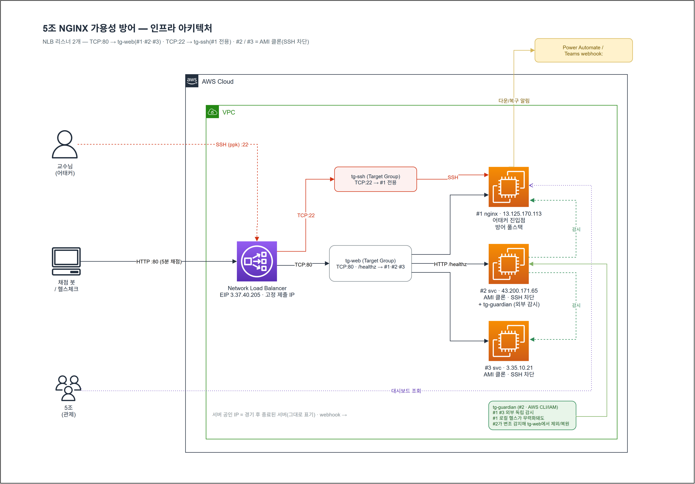

- NLB(EIP, 채점 대상) 뒤에 백엔드 3대.
- `#1` = 어태커 진입점(SSH open, 방어·모니터링 풀스택), `#2`·`#3` = AMI 클론(SSH 차단).
- 타겟그룹 `tg-web` 헬스체크는 HTTP `/healthz`. `#1`이 오염되면 스스로 503을 띄워 빠지고 NLB가 정상 백엔드로 우회한다.

SSH는 `#1`만 받는다(tg-ssh + 보안그룹). `#2`/`#3`은 inbound 22를 차단해 **공격 표면을 `#1` 하나로 한정**했다(네트워크 레벨 격리 — obscurity가 아니라 실제 차단).

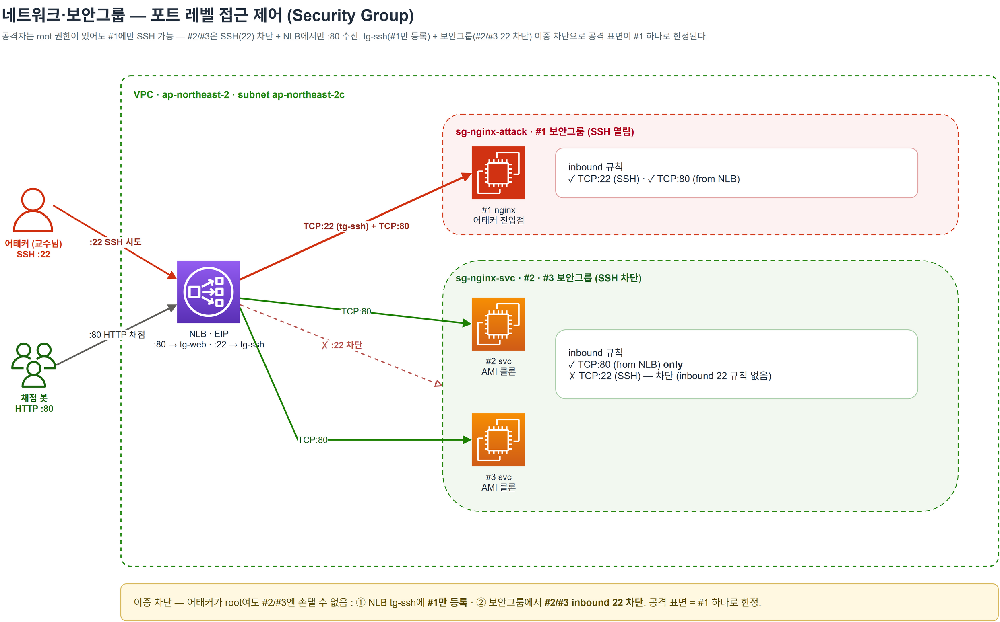

> **실제 가용성의 핵심은 `#1`의 복구력이 아니라 위 구조다.** `#1`이 통째로 무너져도 `#2`/`#3`가 채점 트래픽을 받는다.

---

## 6. 🛡️ 방어 계층

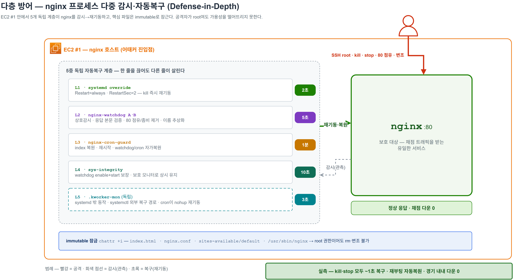

### 복구 — systemd · watchdog · cron

서로 다른 메커니즘이 nginx를 되살린다. 한 계층을 끊어도 다른 계층이 복구를 시도한다(완전 보장이 아니라 **복구 확률·속도를 높이는** 다중화).

| # | 메커니즘 | 주기 | 대응 |
|---|---|---|---|
| ① | `systemd` override `Restart=always` (StartLimit 60s/20회) | 2초 | `kill` |
| ② | watchdog A·B (응답 본문 검증) | 5초 | 본문 검증 · 80 점유자/좀비 제거 · 짝 복구 |
| ③ | cron fallback | 1분 | index 복원 · 재기동 · watchdog/cron 자가복원 |
| ④ | `sys-integrity` (보호 모니터링 서비스) | 10초 | watchdog enable+start 보장 |
| ⑤ | 독립 모니터 `.kworker-mon` | 3초 | systemd 외부 복구 경로(systemctl 의존 없이 동작) |

복구를 동시에 시도하는 계층이 여럿이므로, 재기동은 **`flock` 으로 직렬화**해 충돌을 막는다.

**`chattr +i` 의 역할(정확히)** — `index.html` · `nginx.conf` · nginx 바이너리에 immutable을 건다. 이는 **root를 막는 게 아니다**(root는 `chattr -i` 한 줄로 푼다). **비root·실수·단순 변조를 방지**하고, 변조에 한 단계 비용을 부과해 감사 로그에 흔적을 남기는 용도다.

**보호 모니터링 서비스의 이름 추상화** — watchdog 등을 `nginx-wd-a`·`net-status-mon` 같은 일반적인 서비스명으로 둔 것은 **실무 보안 기법이 아니라**, CTF 환경에서 공격자의 **단순 탐색 비용을 늘리는 보조 수단**이다. `systemctl list-units` 로는 그대로 보이며, 보안 경계로 의존하지 않는다.

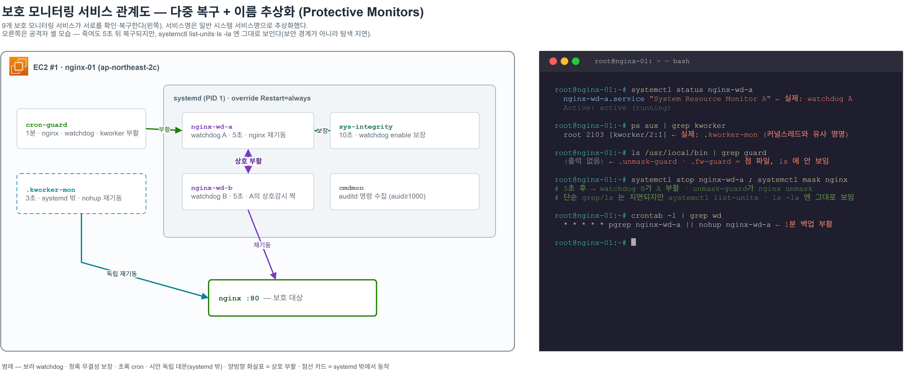

### 변조 감지 · 자가격리 — health check · NLB failover

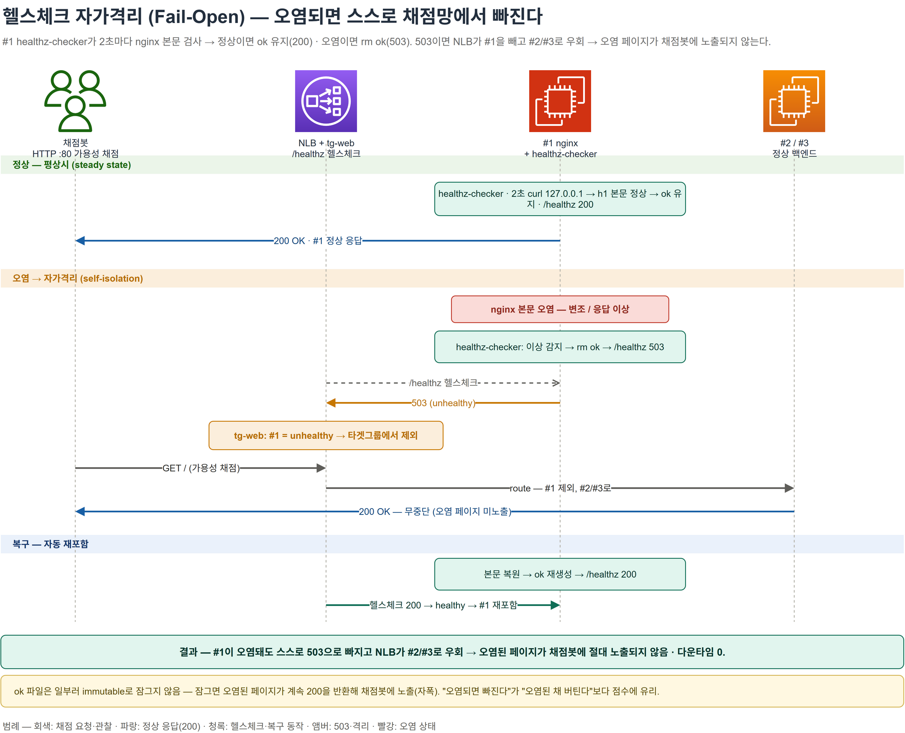

오염되면 **스스로 채점망에서 빠지는** 페일오버다. watchdog·cron·healthz 가 모두 같은 기준(`<h1>NginX를 살려라</h1>`)으로 정상을 판정하도록 통일했다.

```
.healthz-checker.sh (2초마다 curl 127.0.0.1)
   정상 → ok 파일 유지 → /healthz 200
   오염 → rm ok      → /healthz 503 → tg에서 #1 제외 → NLB가 #2/#3로 우회
```

> `ok` 파일은 일부러 immutable로 잠그지 않았다. 잠그면 오염된 페이지가 채점봇에 그대로 노출되는 자폭이 되므로, "오염되면 차라리 빠진다"가 더 안전하다.

### 관측 · 알림 — auditd logging · Teams notification

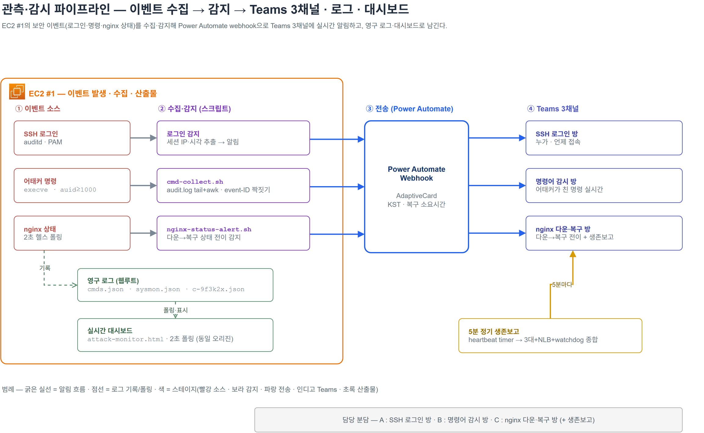

- **명령 추적:** `auditd`(execve) → `cmd-collect.sh`(audit.log tail + event-ID 짝짓기) → `cmds.json`.
- **알림:** Power Automate → **Teams 3채널**(SSH 로그인 / 명령어 / nginx 다운·복구) + 다운→복구 시 webhook(AdaptiveCard, KST, 복구 소요시간) + 5분 생존보고.

> `cmds.json`·`sysmon.json` 등 관측 결과는 **대시보드 데모용**으로 웹루트에 노출돼 있다. 실무에서는 감시 결과를 공개 웹루트에 두면 안 되며, 별도 포트+인증 뒤에 두거나 외부 수집기로 보내야 한다. auditd 역시 감시 대상 박스 위에 있어 root가 정지·삭제할 수 있다.

---

## 7. 📊 실제 효과

| 무엇을 | 어떻게 | 결과 |
|---|---|---|
| nginx 가용성 유지 | 다중 복구 + 자가격리 + 클론 우회 | ✅ **채점 다운 0회** |
| 공격자 행동 관측 | auditd → Teams 3채널 + 대시보드 | ✅ 1·2·3차 공격 전 과정 캡처 |
| 복구 속도 | kill·stop·mask 자동 복구 | ✅ **초~1분** (임계치 분 단위 대비 여유) |

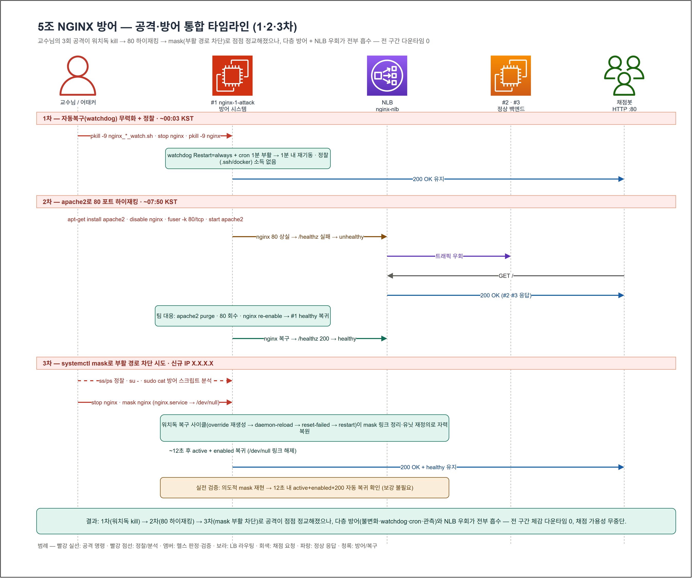

| 차수 | 공격 | 방어 결과 |
|---|---|---|
| **1차** | 자동복구(watchdog) 무력화 + `.ssh`/docker 정찰 | 다중 복구로 1분 내 무위 |
| **2차** | `apache2` 설치로 80 포트 하이재킹 | `apt purge` + 수동 stop(노현주), NLB가 `#2`/`#3`로 우회해 **무중단** |
| **3차** | `systemctl mask nginx`로 부팅 경로 차단 | watchdog 가 `unmask` 후 복구 |

<details>
<summary>차수별 상세 다이어그램</summary>

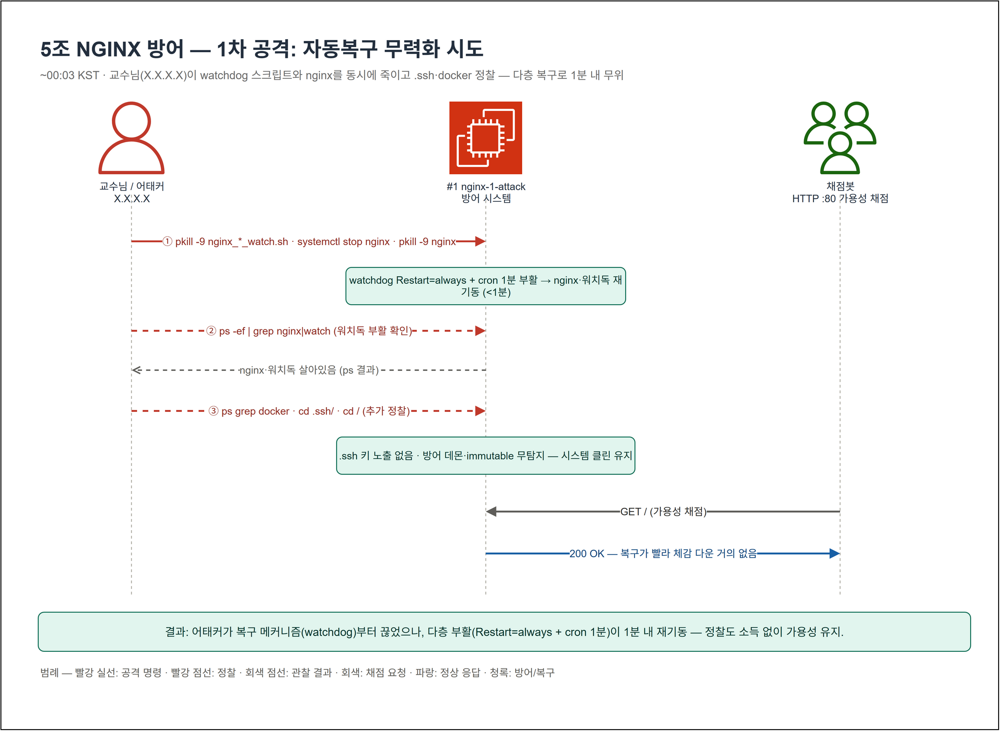
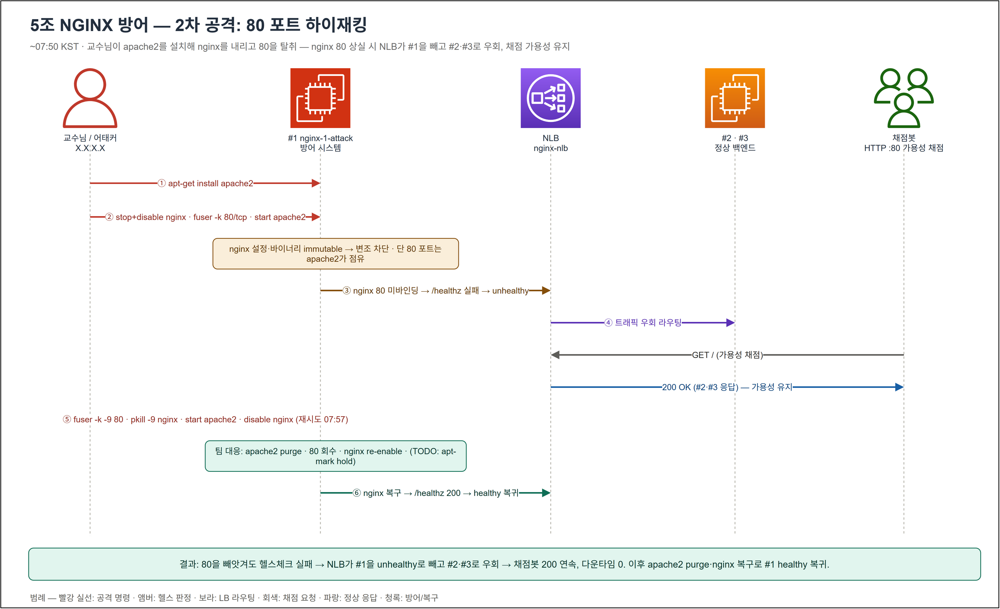
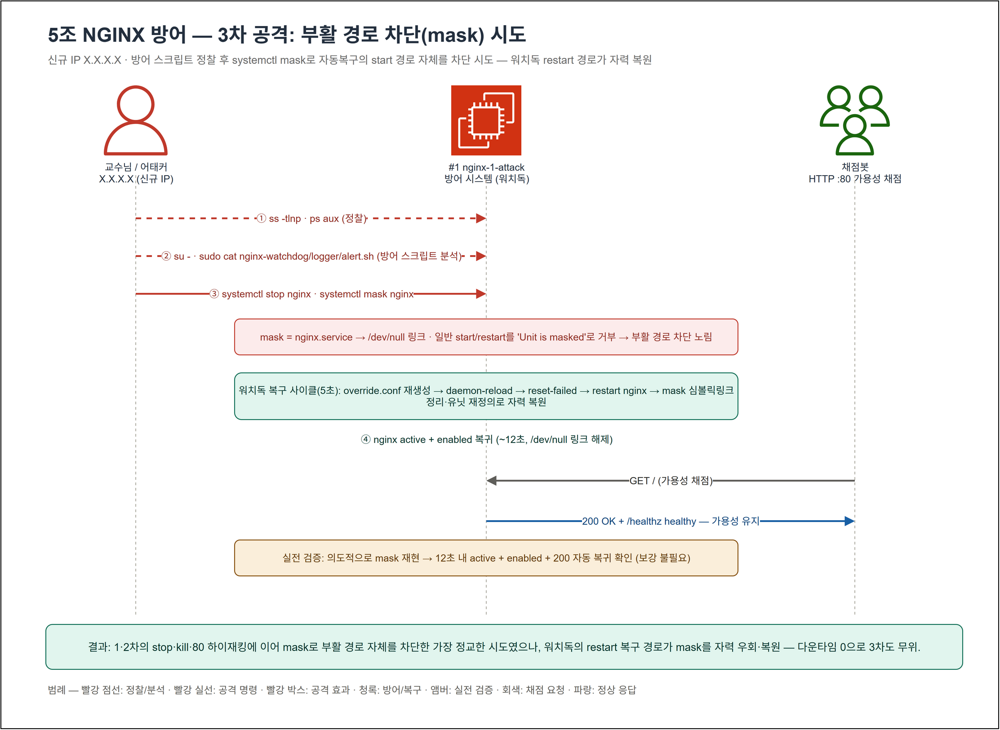

</details>

---

## 8. 📸 실전 관제 · 공격 · 협업 증거

> 경기 중 우리가 직접 만든 대시보드·알림 화면이다. 교수·팀원 개인 IP와 AWS 계정 식별자는 검정 박스로 마스킹하고, 명령·로그·방어 상태는 보존했다. 경기 후 종료한 서버 IP는 그대로 둔다.

### 📊 관제 대시보드

<table align="center">
<tr>
<td align="center" width="33%"><a href="screenshots/monitor-control-tower.png">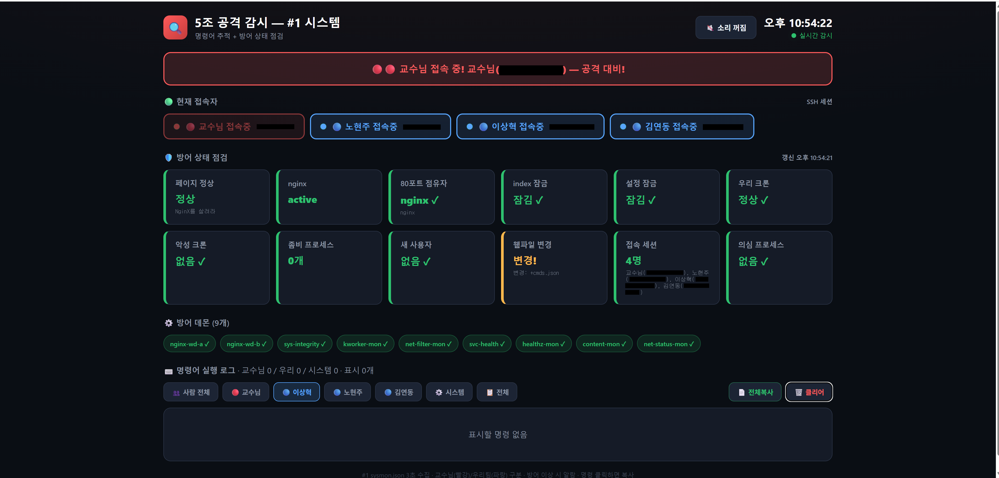</a><br><b>#1 종합 관제</b><br><sub>접속자·복구 계층·모니터링·명령 로그</sub></td>
<td align="center" width="33%"><a href="screenshots/monitor-scoring-public.png">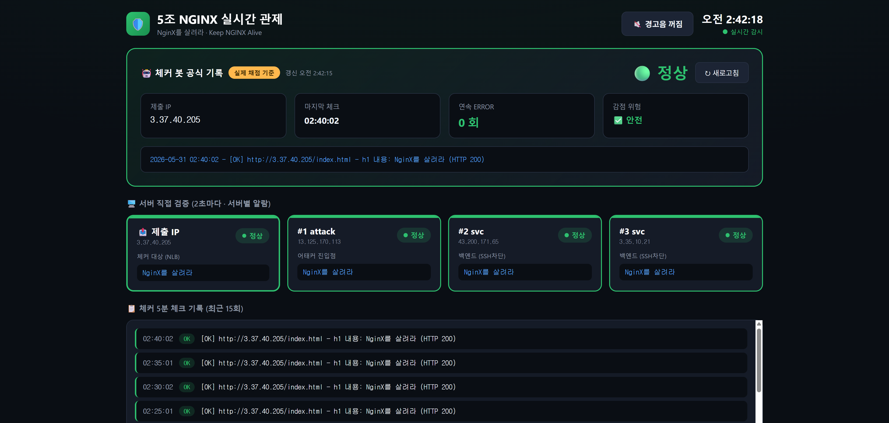</a><br><b>채점 대상(NLB) 관제</b><br><sub>제출 IP + 백엔드 3대 실시간 검증</sub></td>
<td align="center" width="33%"><a href="screenshots/monitor-resource.png">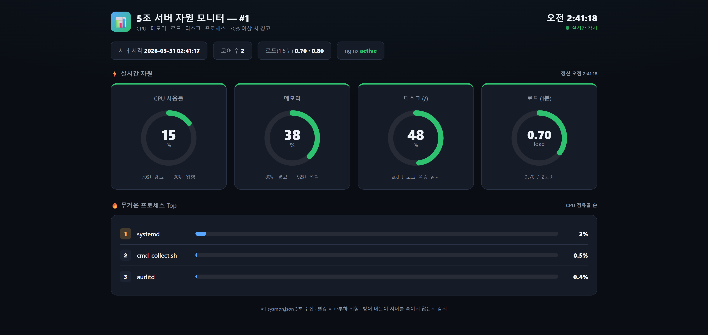</a><br><b>서버 자원</b><br><sub>CPU·메모리·로드·무거운 프로세스</sub></td>
</tr>
</table>

### 💥 공격 · 방어

| 2차 — apache2 80 하이재킹 | 능동 페일오버 (tg-guardian) | 무결성 점검 (stealth-check) |
|:---:|:---:|:---:|
| [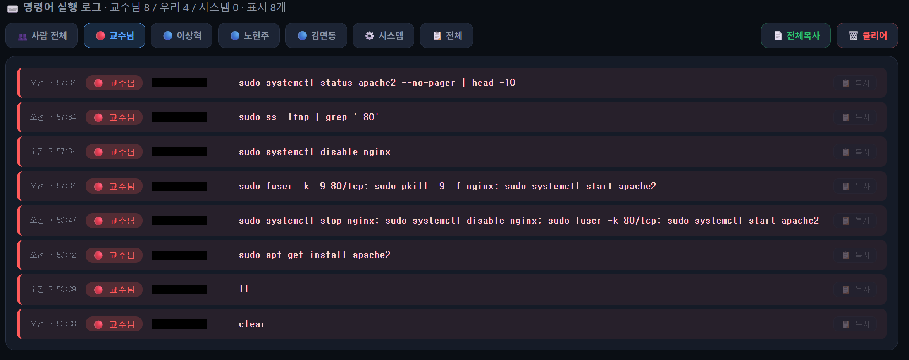](screenshots/attack-2-apache-port-hijack.png) | [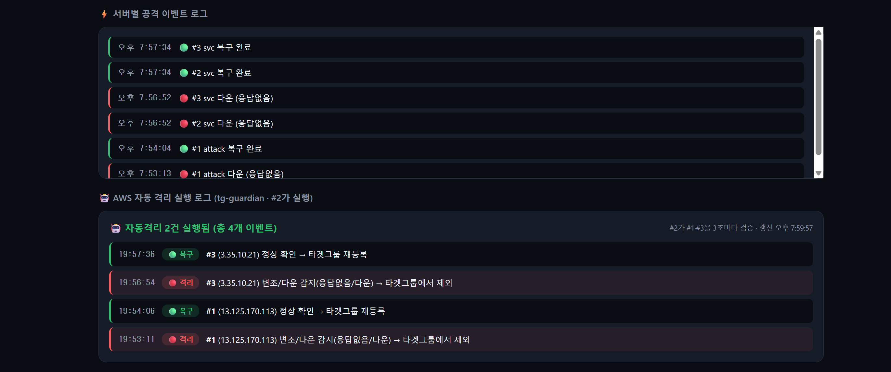](screenshots/failover-target-isolation.png) | [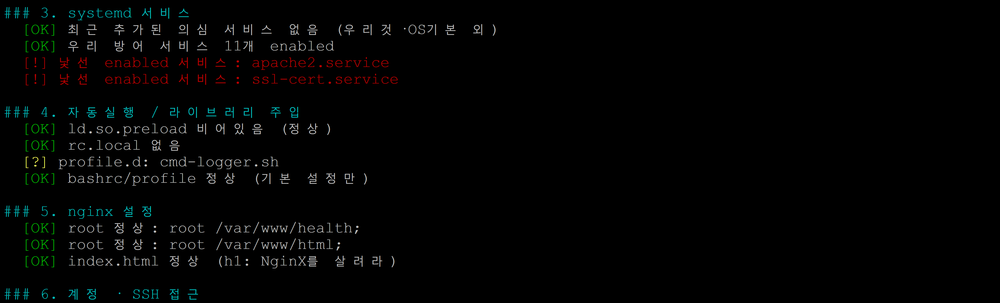](screenshots/integrity-stealth-check.png) |
| `stop nginx`→`fuser -k 80/tcp`→`apt install apache2` | `#2`가 변조 감지 시 타겟그룹 자동 격리/재등록 | 낯선 서비스·주입·설정 변조 스캔 |

### 🔔 자동 알림 (Teams/webhook)

| 변조 감지 | 다운 → 복구 **2초** | 5분 정기 생존보고 |
|:---:|:---:|:---:|
| [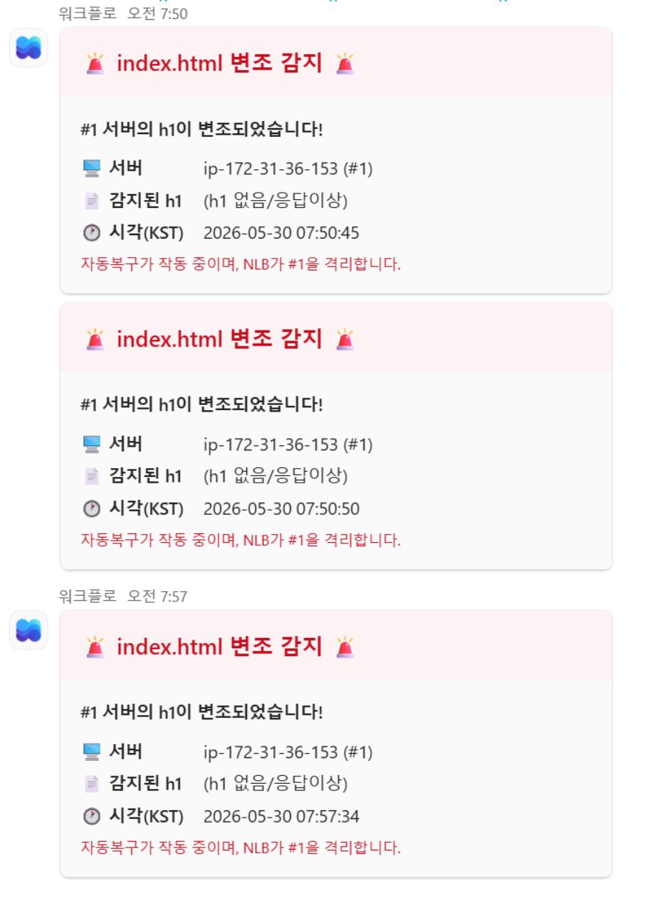](screenshots/alert-tamper.png) | [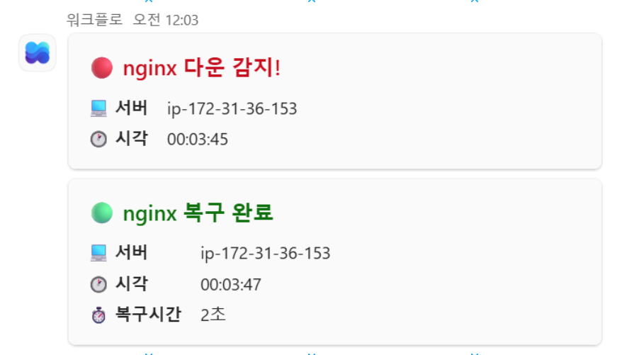](screenshots/alert-down-recovery.png) | [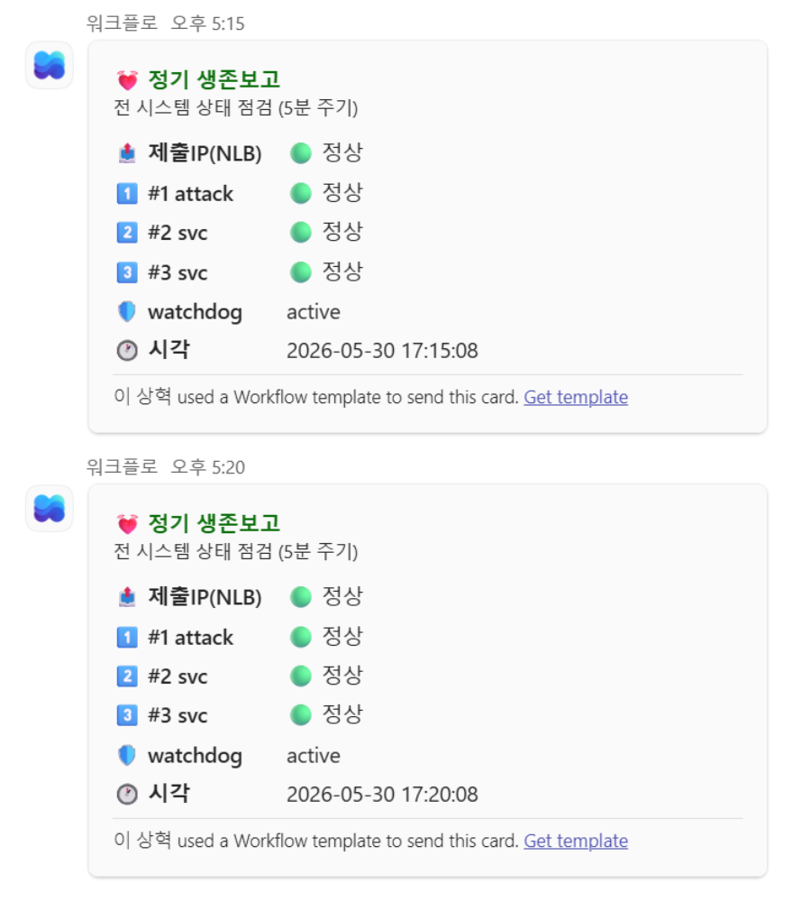](screenshots/alert-heartbeat.png) |

### 🤝 협업 — 동맹 관제 & 새벽 불침번  ·  [자세히](docs/06-alliance-nightwatch.md)

| 동맹 관제 — 3·5·6조 상호감시 | 새벽 불침번 — Discord 교대 |
|:---:|:---:|
| [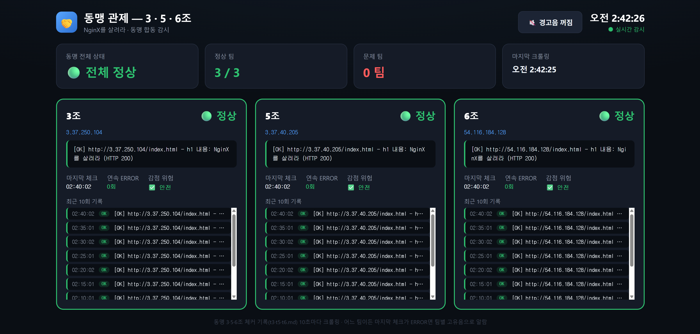](screenshots/alliance-3-5-6-monitor.png) | [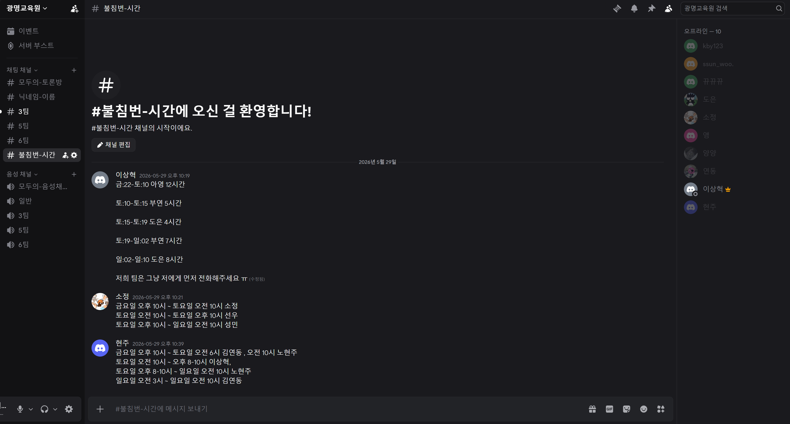](screenshots/nightwatch-discord.png) |
| 규칙상 의무는 없지만 3·5·6조가 서로 다운을 감시·알림 | 김연동·노현주·이상혁이 새벽 교대로 서버 사수 |

---

## 9. ⚠️ 한계와 개선점

이 프로젝트는 **CTF 제약(인프라 변경 불가·공격자 차단 불가) 안에서** 가용성을 높이기 위한 설계다. 실무 기준으로는 다음 한계가 있다.

- **root 공격자는 로컬 방어를 우회할 수 있다.** `chattr -i`·`systemctl stop/disable/mask`·`crontab -r`·`pkill` 을 원자적 스크립트로 한 번에 실행하면, 상호 복구 메시도 무너진다. 로컬 계층은 **최종 방어선이 아니라 복구 시간 단축·격리 트리거**일 뿐이다.
- **인스턴스 내부 복구는 실무 HA의 최종 해법이 아니다.** "오염된 인스턴스를 끝까지 살리는 것"보다 **폐기하고 교체하는 것**이 옳다.
- **`#1` 내부 로그는 공격자에게 변조·삭제될 수 있다.** auditd·`cmds.json` 모두 공격받는 박스 위에 있어 신뢰할 수 없다 — **중앙 로그 저장소**가 필요하다.
- **watchdog 다중화는 복구성을 높이지만 운영 복잡도를 키운다.** 16개 스크립트 + 다수 서비스는 유지보수·장애 분석 비용을 늘린다. 같은 일(재기동)을 여러 계층이 중복 수행한다.
- **헬스체크 플래핑 가능성.** `healthz-checker`에 디바운스가 없어 일시적 `curl` 타임아웃에도 `#1`이 격리될 수 있다. 연속 N회 실패 임계치로 완화 가능하다(NLB 헬스체크 임계치가 일부 완충).
- **단일 서비스 포트(`:80`) 집중.** 규칙상 가용성 공격은 제외됐지만, 실운영이라면 rate limiting·WAF 같은 트래픽 레벨 방어가 없는 게 한계다.
- **관측 산출물의 웹루트 노출**(데모 편의) 은 실무에선 인증 뒤로 가야 한다.

---

## 10. 🚀 실무 확장 방안

같은 목표(가용성·복구·관측)를 **실무 환경**에서 다시 설계한다면:

- **인스턴스 교체형 복구** — 인스턴스 내부에서 끝까지 복구하기보다, 오염된 인스턴스를 폐기하고 **Auto Scaling Group + Launch Template** 으로 새 인스턴스로 교체한다. 헬스체크 실패 → 자동 교체.
- **Multi-AZ** — `#1`/`#2`/`#3`를 여러 가용영역에 분산해 AZ 장애에도 견딘다.
- **중앙 로깅 · 원격 관리** — **CloudWatch Logs**(+ 원격 syslog)로 로그를 박스 밖으로, **SSM** 으로 접근·명령 감사를 표준화한다.
- **IaC** — 방어 스택 배포를 코드화한다. 본 저장소는 [`ansible/`](ansible/)에 멱등 배포 playbook을 포함하며, 인스턴스 교체·Multi-AZ는 Terraform 영역으로 확장한다.
- **트래픽 레벨 방어** — nginx rate limiting·연결 수 제한, WAF 또는 CloudFront/AWS Shield.

---

## 11. 📂 디렉터리 구조

```
keep-nginx-alive/
├── README.md
├── docs/                 # 설계 설명 6편 + 제출용 writeup
├── diagrams/
│   ├── src/              # draw.io 원본 (편집 가능)
│   └── png/              # export 이미지
├── screenshots/          # 실전 대시보드·알림·증거 (마스킹)
├── ansible/              # IaC 배포 (playbook + inventory 예시)
└── scripts/
    ├── bin/              # 복구·헬스체크·관측·알림 스크립트
    ├── systemd/          # 서비스·타이머·override
    ├── cron/             # crontab
    ├── audit/            # auditd 룰
    └── config/           # nginx 설정 · 배포 예시(nginx-defense.example)
```

자세한 스크립트 색인은 [scripts/README](scripts/README.md) 참고.

---

## 12. ▶️ 실행 방법

> 환경 의존적(경기 박스 `#1` 기준). 실제 webhook URL·`index.html`·`ip_names` 등은 `/etc/nginx-defense/` 에 별도 배치한다.

**권장 — Ansible (IaC):**

```bash
cd ansible
cp inventory.example.ini inventory.ini   # 호스트 IP·키 채우기
ansible-playbook -i inventory.ini playbook.yml
```
→ 멱등 배포. 배포 내용은 [`ansible/README`](ansible/README.md) 참고.

**수동 (참고):**

```bash
sudo apt install -y gawk auditd            # cmd-collect 는 gawk 필요(mawk 비호환)
sudo cp scripts/bin/*.sh        /usr/local/bin/
sudo cp scripts/systemd/*       /etc/systemd/system/
sudo cp scripts/audit/*.rules   /etc/audit/rules.d/
sudo systemctl daemon-reload
sudo systemctl enable --now nginx-wd-a nginx-wd-b sys-integrity cmdmon
# cron, /etc/nginx-defense/ 배치는 docs/ 참고
```

---

## 📚 상세 문서 (docs/)

프로젝트의 원리와 구현 디테일이 궁금하시다면 아래 문서를 확인해 보세요.

* **[① 아키텍처](docs/01-architecture.md)**: NLB와 3대의 백엔드 노드를 활용한 트래픽 분산 및 격리 설계
* **[② 다층 방어](docs/02-defense-in-depth.md)**: systemd, watchdog, cron을 활용한 5중 자동 복구 메커니즘
* **[③ 헬스체크 페일오버](docs/03-healthcheck-failover.md)**: 오염된 노드의 자가격리와 무중단 트래픽 우회 원리
* **[④ 관측·감시](docs/04-monitoring.md)**: auditd 기반 로깅 및 실시간 Teams 알림 파이프라인
* **[⑤ 공격 타임라인](docs/05-attack-timeline.md)**: 1차~3차 공격에 대한 방어 시스템의 실제 대응 기록
* **[⑥ 동맹·불침번](docs/06-alliance-nightwatch.md)**: 타 조와의 상호 감시 동맹 및 야간 관제 회고

> **[제출용 Write-up (4항목) 보러가기](docs/writeup.md)**

## 🔒 마스킹 정책

- 공인 IP → `X.X.X.X`, webhook URL → `<REDACTED_WEBHOOK_URL>`
- 팀원 IP↔실명 매핑 `ip_names`는 저장소에서 제외(`ip_names.example`만 포함), 런타임 데이터는 `.gitignore`
- 스크린샷은 개인 IP·AWS 계정 식별자를 검정 박스로 마스킹(명령·로그·방어 상태는 보존)

## 📄 라이선스

[MIT](LICENSE)
