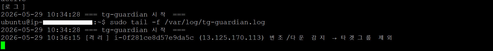
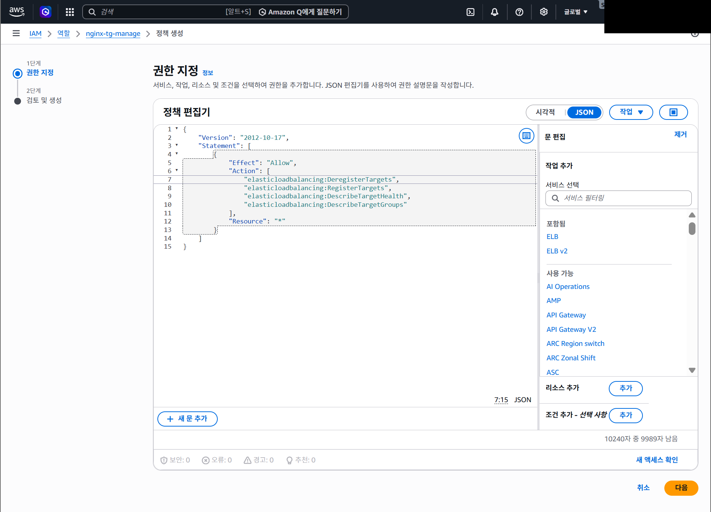

# ③ 헬스체크 자가격리 (Failover)

> 교육용·방어 전용. "복구가 안 되면 차라리 스스로 빠진다"는 마지막 안전장치.


## 동작

`#1`이 오염돼 복구가 즉시 안 되는 최악의 경우, **자기 자신을 채점망에서 빼서** 오염된 페이지가 채점봇에 노출되지 않게 한다.

```
.healthz-checker.sh (2초마다 curl 127.0.0.1)
   정상 → ok 파일 유지 → /healthz 200
   오염 → rm ok       → /healthz 503 → tg가 #1 제외 → NLB가 #2/#3로 우회
```

```bash
# scripts/bin/healthz-checker.sh (발췌)
if curl -s -m 3 http://127.0.0.1:80/ 2>/dev/null | grep -qF "$NEEDLE"; then
  [ -f /var/www/health/ok ] || echo "healthy" > /var/www/health/ok   # 정상 → ok 보장
else
  rm -f /var/www/health/ok 2>/dev/null                               # 오염 → ok 제거(503 유발)
fi
```

> **채점 대상(NLB) 실시간 관제** — 채점봇이 보는 제출 IP(NLB)와 백엔드 3대(`#1`/`#2`/`#3`)를 우리도 2초마다 동일하게 직접 검증한다. 한 대가 빠져도 나머지로 200이 유지되면 채점은 통과. (서버 IP는 경기 후 종료됨)
>
> 

## 왜 `ok`는 immutable로 잠그지 않았나

[② 다층 방어](02-defense-in-depth.md)에서 `index.html`·`nginx.conf`는 `chattr +i`로 잠갔지만, **`ok` 파일은 일부러 잠그지 않았다.**

만약 `ok`를 잠가두면, 페이지가 오염된 상태에서도 `/healthz`가 계속 200을 반환해 **오염된 #1이 채점봇에 그대로 노출**된다. 그건 자폭이다.

> 잠그는 게 항상 안전한 게 아니다. "오염되면 빠진다"가 "오염된 채 버틴다"보다 점수에 유리하다. 채점은 *정상 응답*을 보기 때문이다.

## 검증

- `ok` 존재 → `/healthz` 200, tg `healthy`
- `rm ok` → `/healthz` 503, tg가 `#1` 제외 → NLB가 정상 백엔드로 라우팅 (무중단)

## 능동 격리 — tg-guardian (`#2`에서 실행)

NLB 헬스체크(`/healthz` 503)에 의한 **수동적** 우회에 더해, 깨끗한 클론인 `#2`가 **능동적으로** `#1`/`#3`의 응답을 감시한다. 변조·다운을 감지하면 AWS CLI로 직접 타겟그룹에서 빼고(`#2`에 IAM 역할 `nginx-tg-manage` 부여, `elasticloadbalancing:DeregisterTargets`), 정상 복구되면 다시 등록한다. 채점 NLB와 무관하게 도는 **독립 페일오버 라인**이다.

> **왜 "외부" 감시인가.** NLB 헬스체크는 `#1`이 스스로 띄우는 `/healthz`에 의존한다. 공격자가 `#1` 안에서 헬스 로직을 무력화·위조해 **가짜 200**을 유지하면 NLB는 못 잡을 수 있다. 반면 `tg-guardian`은 **`#2`에서 `#1`의 실제 응답을 직접 검증**하므로, `#1`의 로컬 방어가 뚫려도 밖에서 변조를 잡아내 격리한다. 자기 자신을 감시하는 게 아니라 **이웃이 감시**하는 구조가 핵심.

> **자동 격리 실행 로그** — `#2`의 tg-guardian이 `#1`·`#3`의 변조/다운을 감지해 타겟그룹에서 제외하고, 복구되면 재등록한 기록. (백엔드 공인 IP 마스킹)
>
> 

> **raw 터미널 로그** — `#2`에서 `sudo tail -f /var/log/tg-guardian.log`로 본 실제 격리 순간: `[격리] i-… (13.125.170.113) 변조/다운 감지 → 타겟그룹 제외`. (사설 호스트명 마스킹 · 종료된 서버 공인 IP는 표기)
>
> 

> **격리 권한 (IAM 정책)** — tg-guardian이 타겟그룹을 제어하기 위해 부여한 최소 권한(ELB 타겟 등록/해제·상태조회)뿐이다. (계정 식별자 마스킹)
>
> 

## 설계상 제약 / 한계

tg-guardian는 "이웃이 감시"하는 강력한 외부 페일오버지만, 현재 구성엔 다음 한계가 있다.

- **단일 감시자(SPOF).** tg-guardian는 현재 `#2` 단일 노드에서만 동작한다. `#2`가 장애를 겪으면 이 능동 격리 기능도 함께 멈춘다. (단, `#1`의 `/healthz` 자가격리와 NLB 헬스체크는 별개로 계속 동작한다.)
- **폴링 기반 검출 지연.** `#1`/`#3`의 응답을 주기적으로 폴링해 판정하므로, 변조·다운 발생 시점과 격리 시점 사이에 **폴링 주기만큼의 지연**이 존재한다.
- **프로브 회피 가능성.** `#1`이 tg-guardian 프로브에만 정상 응답하고 채점봇에는 다른 응답을 주는 정교한 회피에는 취약하다(동일 경로·헤더로 검증해야 함).

**실무 확장** — 감시 노드를 다중화하거나(여러 노드가 교차 감시), CloudWatch 같은 **중앙 모니터링·합성 모니터링(Synthetics)**으로 외부 관점을 일원화하면 단일 감시자·검출 지연 문제를 줄일 수 있다.

---

관련: [① 아키텍처](01-architecture.md) · [② 다층 방어](02-defense-in-depth.md)
