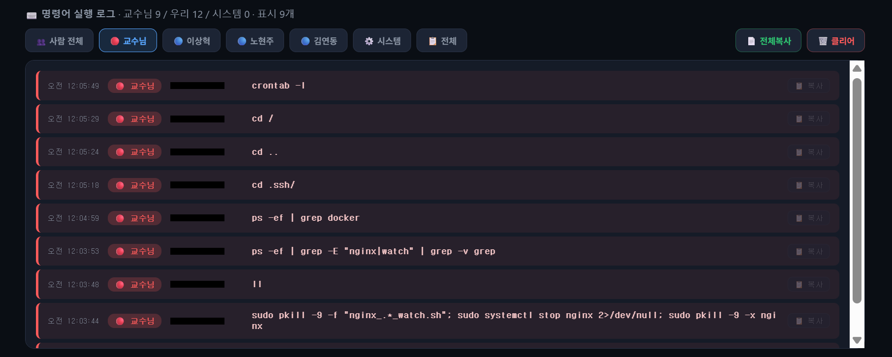

# ⑤ 공격 타임라인 (1·2·3차)

> 교육용·방어 전용. 공인 IP는 마스킹(`X.X.X.X`)됨.

경기 내내 우리 `#1`은 채점 다운 0회를 유지했다.

## 1차 — 자동복구 무력화 시도

- **공격:** watchdog 스크립트와 nginx를 동시에 kill, `.ssh`·docker 정찰.
- **방어:** systemd(2초) + watchdog(5초) + cron(1분) 다층 복구로 1분 내 무위. 한 라인을 끊어도 다른 라인이 살림.

> **실제 공격 명령 로그** — 우리 관제 대시보드가 어태커 명령을 실시간 수집한 화면. `.ssh/`·docker 정찰과 `pkill -9 -f "nginx_*_watch.sh"`로 watchdog를 노린 흔적이 그대로 남았다. (어태커 IP 마스킹)
>
> 

## 2차 — apache2로 80 포트 하이재킹

- **공격:** `apt install apache2`로 80 포트를 점유해 nginx 응답을 탈취.
- **방어:** watchdog가 80 점유자(apache)를 제거 + `apt purge` + **수동 stop(노현주)**. 동시에 `#1`이 [헬스체크에서 자동 격리](03-healthcheck-failover.md)되어 NLB가 `#2`/`#3`로 우회 → **무중단**.

> **실제 공격 명령 로그** — `systemctl stop/disable nginx` → `fuser -k 80/tcp` → `apt-get install apache2` → `systemctl start apache2`로 이어지는 80 포트 하이재킹 명령이 순서대로 기록됐다. (어태커 IP 마스킹)
>
> 

## 3차 — systemctl mask로 부팅 경로 차단

- **공격:** `systemctl mask nginx`(+ 방어 서비스 mask)로 재기동 자체를 막으려 시도.
- **방어:** `unmask-guard`(서비스명 `svc-health`)가 3초 내 `unmask` 후 재기동. **이 mask 자력 복원이 이번 방어의 하이라이트.**

## 복구 시간 (설계 기준 예상)

아래는 **각 복구 계층의 폴링 주기 + 재기동 소요로 산출한 설계 기준 예상치**다(스톱워치 실측이 아님). 정확한 수치는 아래 측정 방법으로 재현·계측한다.

> **측정 방법** — 다운 발생 시점 `t0`부터, 로컬 `curl http://127.0.0.1/`가 **HTTP 200 + `<h1>NginX를 살려라</h1>` 본문**을 반환하는 시점 `t1`까지. 복구 시간 = `t1 − t0`. (채점봇 관점의 NLB 우회 체감 시간은 타겟그룹 헬스체크 임계치가 별도로 더해진다.)

| 공격 | 감지 주체 (주기) | 복구 방식 | 예상 복구 시간 |
|---|---|---|---|
| `nginx kill` | systemd (프로세스 종료 즉시) | `Restart=always` (RestartSec=2) | **~2초** |
| watchdog `kill` | sys-integrity (10초) · cron (1분 백업) | 워치독 enable + start | **~10초** (최대 1분) |
| apache2 80 포트 하이재킹 | watchdog (5초) | 80 점유자 제거 + nginx 재기동 · 병행해 `/healthz` 503 자가격리로 NLB가 `#2`/`#3` 우회 | **~5초** (체감 무중단) |
| `systemctl mask nginx` | unmask-guard / `svc-health` (3초) | `unmask` 후 워치독 재기동 | **~3초** |

> **실측 1건** — `nginx kill`의 경우 Teams 알림이 **다운→복구 2초**를 기록해(④ 관측의 `alert-down-recovery`) 설계 예상치(~2초)와 일치했다. 나머지 공격은 동일한 방법으로 계측하면 표의 예상치 부근으로 수렴할 것으로 본다.

---

관련: [② 다층 방어](02-defense-in-depth.md) · [③ 페일오버](03-healthcheck-failover.md) · [제출용 write-up](writeup.md)
